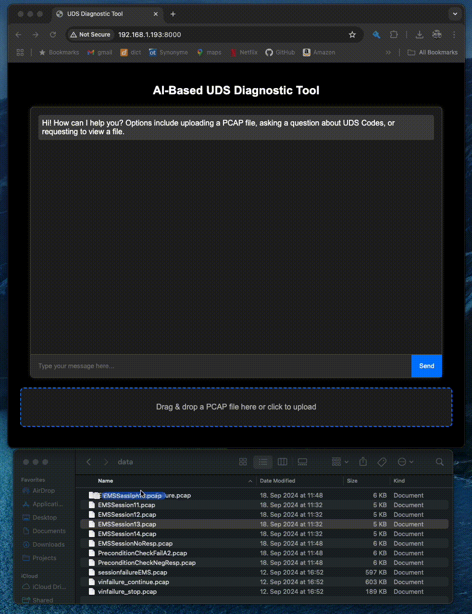
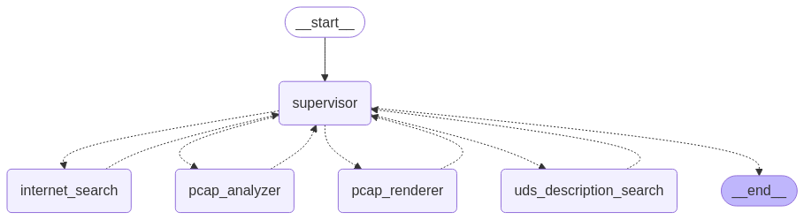

# AI-Based UDS  Diagnostic Tool

## Introduction
This tool is designed to analyze communication between automotive electronics based on the [Unified Diagnostic Services (UDS)](https://en.wikipedia.org/wiki/Unified_Diagnostic_Services) protocol contained in a [pcap file](https://en.wikipedia.org/wiki/Pcap). This diagnostic tool enables users to upload a PCAP file into a browser-based chatbot interface, where the analysis is automatically performed. Users can also ask follow-up questions about the PCAP file and analysis, prompt the chatbot to view the file (rendered as HTML), and ask questions about the UDS standard or specific UDS codes. The chatbot additionally has internet access, making it possible for the chatbot to attempt to answer questions beyond the data provided.

## Background
This is a similar code base to a project I worked on while a Senior Data Scientist at Luxoft, though with some differences. This original project was a small internal demonstrator, primarily to evaluate the feasibility of using LLMs to parse PCAP trace data. It was ultimately deemed not worth continuing given the data preprocessing (currently) required for an LLM to digest and make sense of a PCAP file.


# Quick Start

## Python Environment
If you are running this on a Mac machine with a recent M-series chip and you have [Conda](https://anaconda.org/anaconda/conda) installed in your system path you can simply run:

```console
conda env create -f environment.yml 
```

Unfortunately, this software has not yet been tested on other operating systems or non-M-series Mac machines. You will have to create your own virtual environment based on `environment.yml`.


## Configuring LLM and Tavily Endpoints
This tool requires configuration of an LLM endpoint. Currently, it is set up to use OpenAI's API (GPT-4o) endpoint. Additionally, to enable the LLM to access the web, this tool uses [Tavily](https://tavily.com/), a popular API search engine for LLMs. These are expected to be in (not present) file `./env`. An example configuration is contained in [./env_example](./env_example).


## Start the Diagnostic Tool

```console
python app.py
```

Running this script begins a [Flask](https://en.wikipedia.org/wiki/Flask_(web_framework)) application on **http://192.168.1.193:8000**. Note - depending on your configuration, you may need to customize the port and/or IP address for this application. This can be done in the last line of `app.py`.

## Using the Tool


## Upload PCAP File for Analysis
You can upload a PCAP file for analysis by either clicking the upload button or using the drag-and-drop functionality. This action automatically triggers the PCAP analyzer agent (see [Architecture](#architecture) below) to diagnose any errors in the PCAP file. It is also possible to ask follow-up questions about the PCAP file, or even ask to view an HTML-rendered Pandas DataFrame of the PCAP file (see below).

Under-the-hood, uploading a PCAP file triggers a series of actions, involving potentially multiple LLM agents:

- Read the raw PCAP file, converting to a Pandas DataFrame
- Merging UDS SID and NRC code explanations from a SQLite database stored at `./uds/uds_codes.db`. 
  - Programmatically merging explanations on UDS codes was found to yield more accurate interpretations, as OpenAI's GPT-4o tended to invent explanations for particular UDS codes
- Matching request-reply pairs on ECU address
- Export original PCAP and CSV rendering to `./uploads`. Note - existing PCAP and CSV files in this folder will be first deleted, to avoid any confusion. This means it's only possible to examine one PCAP file at a time
- [pcap analyzer agent](./agents/pcap_analyzer.py) reads CSV, converts to string, and this is passed to the LLM for analysis
- The [pcap rendering agent](./agents/pcap_renderer.py) is used to view an HTML-rendered Pandas DataFrame of the original PCAP file

## UDS Code Lookup & Internet Search Capability
The diagnostic tool is capable of querying the local SQLite database to list UDS SID/NRC codes or answer questions about select codes. The tool is instructed to first query its local UDS codes (under `./uds_uds_codes.db`), thereafter perform an internet search for additional information.

# Architecture

This tool uses a [multi-agent network](https://langchain-ai.github.io/langgraph/tutorials/multi_agent/multi-agent-collaboration/) architecture using [LangGraph](https://langchain-ai.github.io/langgraph/). Multi-agent networks are useful in the presence of multiple tools (e.g. internet search, Python preprocessing steps, SQLite database lookup agent), which a single agent may struggle to use as effectively. Multi-agent networks enable each agent to specialize on a single task or set of tasks, rather than requiring one agent to perform all actions. 

Multiple agent architectures exist (for examples, [see](https://langchain-ai.github.io/langgraph/tutorials/#chatbots)) for different purposes. In particular, this tool uses a [multi-agent supervisor architecture](https://langchain-ai.github.io/langgraph/tutorials/multi_agent/agent_supervisor/), where one supervisor LLM agent orchestrates different child agents, selecting which agents to route to and in which order. The supervisor agent decides when a given prompt has been adequately completed or if additional information is required from either the user (a human) or one of its child agents, including potentially their tools. This figure below depicts this network.



## Agents and Tools
This tool comprises the following LLM Agents and Tools:

- [internet_search](agents/internet_search.py): Agent provided with internet search capability via Tavily
- [pcap_analyzer](agents/pcap_analyzer.py): Agent responsible for analyzing an uploaded PCAP file. This agent has one tool at its disposal: 
  - `select_and_read_csv`: Reads preprocessed PCAP file (as CSV) present under `./uploaods` and converts this to string for LLM. The Flask upload route includes initial preprocessing of a PCAP file.
- [pcap_renderer](agents/pcap_renderer.py): Renders a preprocessed PCAP file as HTML version of Pandas DataFrame. This agent has two tools at its disposal:
  - `render_dataframe_head`: Renders only the first 5 rows of the Pandas DataFrame PCAP file
  - `render_dataframe_full`: Renders all rows of the Pandas DataFrame PCAP file
- [uds_codes](agents/uds_codes.py): [SQL agent](https://langchain-ai.github.io/langgraph/tutorials/sql-agent/) for completing SQL code to query the SQLite database of UDS codes, stored under `./uds/uds_codes.db`. This agent has the follow tool at its disposal:
  - `sql_search`: Connects to SQLite database and returns results as pd.DataFrame